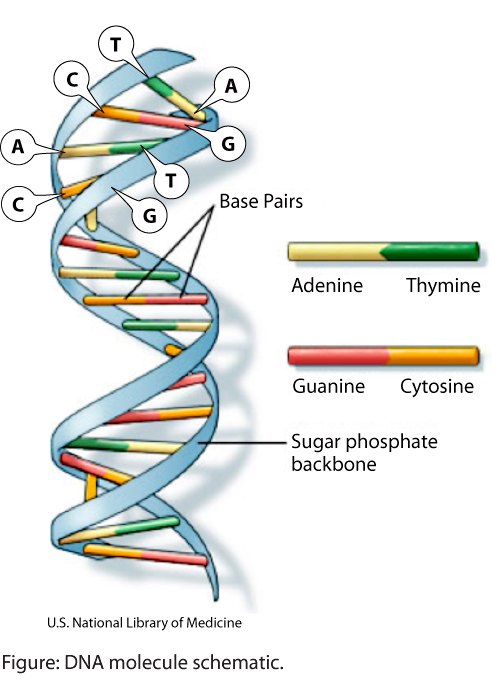
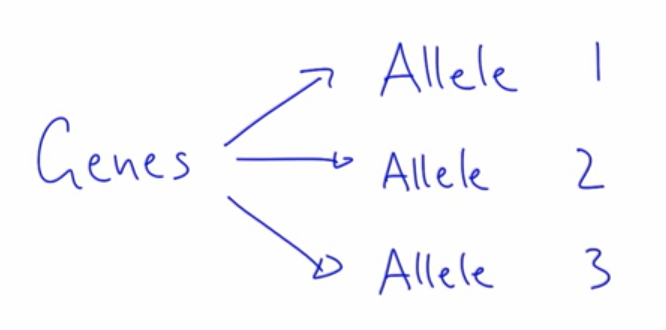
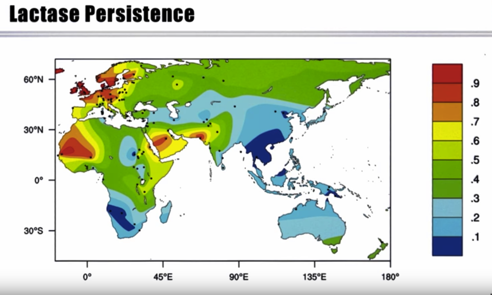
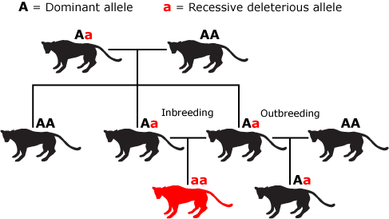

# Evolution

*Definition:* The change in allele frequencies in a population over time.

## What is an Allele? 

The generic information of all life is sorted in a molecule called **DNA**. 
There's a variant of it, **RNA**, but details don't matter right now.

DNA stores information and stretches of this molecule are called genes and these are the stretches that encode information that can be translated into proteins.

These proteins can then create cells, the cells create tissues, organs, and, ultimately, individuals.

But, if we were to transmit this genetic information from generation to generation, unchanged, and if nothing would ever change over time,
all of us would have the exact same genes, then that would be quite a boring world
and the world would not be as diverse as it currently is, so something else has to be there.

And what this is is that genes don't just come in one version, there isn't just a gene.

For every gene, there are multiple versions, 
and these versions are called **alleles**.

### *For example:*

This is a map of the frequency, in color code,
of **Lactase Persistence**.

So, when humans are born,they all have the ability to digest milk.
But normally, over time, humans actually lose this ability,
and as adults, are lactose intolerant-- they cannot digest lactose anymore.

But, a few individuals, or actually, quite many, depending on which region of the world we're looking at, have the ability to continue to digest milk as adults
and those are called lactase persistent individuals.

This would completely agree with our definition of evolution,
namely, that this particular allele
changed in frequency over time.

*Example with cats:*

## 4 Nature forces

* Natural selection
* Genetic Drift
* Migration
* Mutation

