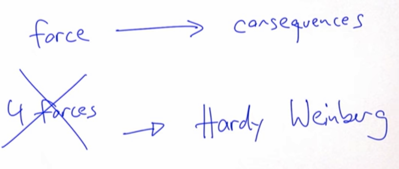
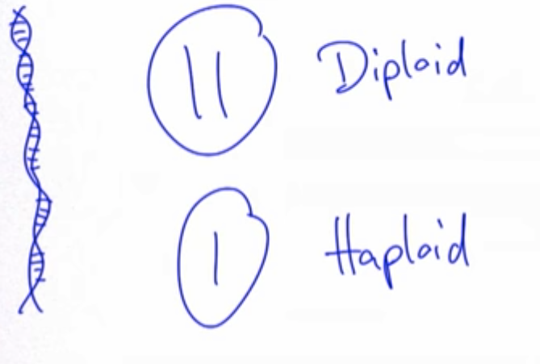
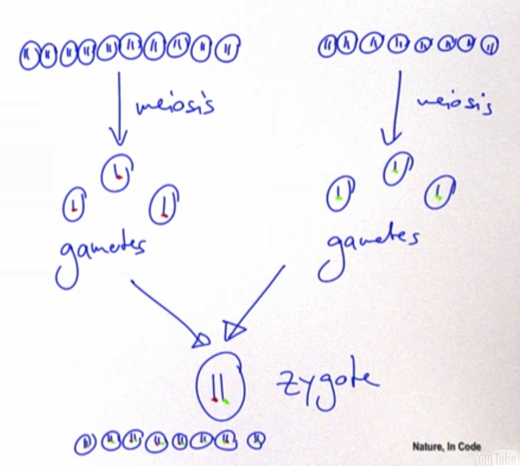
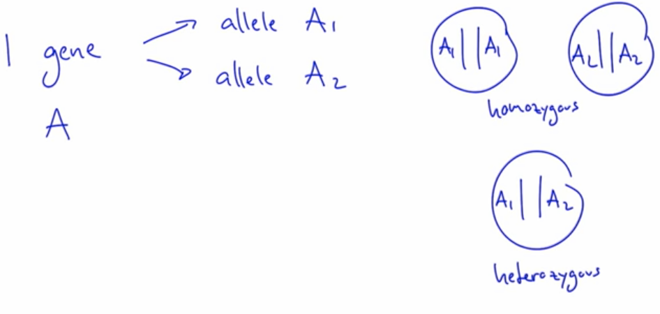

# Hardy-weinberg model

## Null model

Null model is a very important idea in all of science.
Imagine you have some kind of system
and now you're applying some force to the system,
and then later you may observe that the system changes,
so there is some consequences possibly of you applying this force.

But how do you in fact know that the system changed
*because* you applied this force?

Is it possible that the system would have changed,
or now behaves in a way that it would have anyway,
without you applying this force?

And so, what you need to do in order to understand this,
is you need to remove this force,
need to remove all forces of interest
to get to a **null model** that describes the system, how it would work
without any of the forces that you're interested in.

We have **four forces**,
that we now understand, are major forces to affect evolution
and to affect the composition and the allele frequencies in populations.

And so what we need to do is we need to ensure
that **none of those four forces is acting**,
in order to get to our **null model**.

## Hardy-weinberg model

Is a very simplified model of the world,
but it helps us understand what would happen.

What does the world look like from a population genetic perspective
if none of those four forces is acting?

Hardy-Weinberg is right there at the beginning
because we need to understand what happens without any of those four forces,
and then we can later slowly add the forces one by one,
either in combination or as single forces,
and then we can understand much better what happens *because* of those forces.

Most animals are **diploid,** which means that in each of your cells,
in fact, not only have one copy of your genetic material,
but **two** copies, and hence the word diploid. And this is true for almost all animals.

There are some cells and also some animals that are **haploid** (one copy),
and plants are in fact very fascinating
because they have even more complex cells, and more complex genetic systems
where you have three, four, or even more copies,
but for the context of this course, we'll focus on humans or animals,
and we'll focus on diploid systems.

Practically all of your cells are diploid,
some of them are actually haploid and this is really important
from an evolutionary perspective, because it is those cells
that are actually used for **sexual reproduction**.

**Meiosis** is a very important process where these haploid cells are created.
These haploid cells are called **gametes** and are used for sexual reproduction.

And now these two individuals can engage in sexual reproduction,
each of them providing one gamete.

So you pick one gamete from one person, and anotherone from another person, and fuse them
and create the first cell of a new individual, a new generation.
This new cell is called a **zygote**, and is now again diploid.

By the way, in males we call these gametes, **sperm cells**,
and in females we call these gametes, **eggs**. 

We have one genetic material copy from our father, and one copy from our mother.

**Homozygous** is where the two copies are the same allele, and **heterozygous** is where both copies are different alleles.

