# Genetic drift

## Intro

Now we are changing the rules of the previus Chapter. 
Now we are working with **Finite population size**.

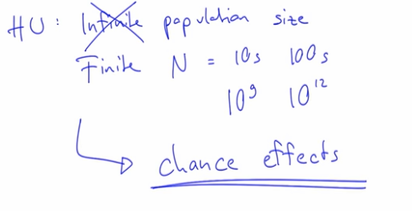

Population size is typically denoted
with this capital "**N**" letter.

Now a finite population size can mean many things.
We can talk about only tens of individuals,
or perhaps hundreds of individuals,
but we can also talk about a very, very large population size,
even billions of individuals,
or sometimes even trillions of individuals.

If you think about, for example, single-celled organisms,
bacteria, for example,
these can often be--
the population sizes of these species can often be very, very large.

With finite population sizes,
there are **chance effects**,
and this is the key effect of this chapter
and the principal cause of **genetic drift**.

**Chance effects** will be stronger in smaller populations.

## *Example:*

50% means that if you flip 10 times a coin 5 times was head and 5 times was tail? 
No... Maybe is 4:6, 3:7, 6:4... etc **It's not always the same result**!
It's random! 0:10 and 10:0 are also possible...

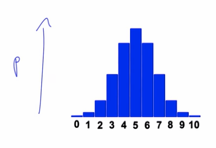

We can calculate how often are each of these scenarios with 
the **binomial distribution**.

Imagine that we have 10 slots, each of these slots can have one of two outcomes:
namely heads (H) or tails (T).
 
### **What is the probability that we get exactly two tails?**

1. Know
how many possible outcomes are there in the first place: **2 outcomes**.
2. Know how many times/slots are you flipping the coin: **10 times/slots**.
3. Know how many possible outcomes we have? **2^10 = 1024**.
4. Know how many possible ways to put two *Tails* into the ten slots?
    * Put one Tail: **10 possible slots**
    * Put the second Tail: **9 possible slots**
    * Number of ways to put those: **2**
    * Possible outcomes: (10 x 9) / 2 = **45**
5. Know the probability
that we get exactly two tails when we flip a fair coin ten times: 45/1024 = 0.0439 => **4,39 %**

**Another way to do it (via JavaScript):**

```javascript 
const tossCoins = () => {
  let heads = 0,
      tails = 0;

  for(let i = 0; i < 10; i += 1) {
      Math.random() < 0.5 ? heads += 1 : tails += 1;
  }
  
  return tails === 2;
}


const repeats = 10000000;
let counter = 0;

for(let i = 0; i < repeats; i += 1){
  if(tossCoins()) {
    counter += 1;
  }
}

console.log(`Getting 2 tail ${(counter/repeats)} % of the time`);
// => "Getting 2 tail  0.0439117 % of the time"
```

The same in a more functional way...

```javascript
const tossCoins = (coins) => Array(coins).fill(1).map(x => Math.random() < 0.5);
const pairTailsInTenCoins = () => tossCoins(10).filter(isHead => !isHead).length === 2;

const calcProbability = (repeats) => Array(repeats).fill(1)
  .map(pairTailsInTenCoins)
  .filter(areTwoTails => areTwoTails)
  .length / repeats;


console.log(`Getting 2 tails ${calcProbability(100000)} % of the time`);
// => "Getting 2 tail  0.0439117 % of the time"
```

----------------
**Another exemple in JavaScript**

Write a function **children_in_family** that returns a number between 0 and 6 with the following probabilities:

* 0: 10%
* 1: 26%
* 2: 33%
* 3: 18%
* 4: 9%
* 5: 3%
* 6: 1%

Example: If we call the function **children_in_family** 1000 times, we should get the number 0 100 times, the number 1 260 times, the number 3 330 times, and so on.

```javascript
function children_in_family() {
    var value = Math.random();
    if (value < 0.1 ) return 0; // 10% =       10% ;-)
    if (value < 0.36) return 1; // 36% = 10% + 26%
    if (value < 0.69) return 2; // 69% = 36% + 33%
    if (value < 0.87) return 3; // 87% = 69% + 18%
    if (value < 0.96) return 4; // 96% = 87% +  9%
    if (value < 0.99) return 5; // 99% = 96% +  3%
    return 6;
}
```

## Generic drift

After these probability examples in JavaScript now we are ready to know how works this in the genetic world.

Remember: Now we are working with **Finite** population size.

### *Example:*

* **N = 10** *(Remember the **N** is the number of population, 10 individuals)*.
* **2N = 20** *(We have 20 alleles, 2 per individual)*
* **p = q = 0.5**

If after applying the 50% random we obtain **9 A1** and **11 A2**, the **p** and the **q** is changing. 

* **p = 9/20 = 45%**
* **q = 11/20 = 55%**

Now a similar example in JavaScript taking N = 1000:

```javascript
let p = 0.5;
const N = 1000;
const generations = 1000;

const round = (value, decimals = 2) => {
  const shifter = Math.pow(10, decimals);
  return Math.round(value * shifter) / shifter;
}

const nextGeneration = () => {
  const draws = 2 * N;
  let a1 = 0;
  let a2 = 0;

  for(let i = 0; i < draws; i += 1) {
    Math.random() > p ? a1++: a2++;
  }

  p = a1 / draws;
};

for(let i = 0; i < generations; i += 1) {
  nextGeneration();
  console.log(`Generation ${i}, ${round(p*100)}%, ${round((1-p)*100)}%`);
}
```

In more functional way:

```javascript
const round = (value, decimals = 2) => {
  const shifter = Math.pow(10, decimals);
  return Math.round(value * shifter) / shifter;
};

const nextGeneration = n => p => Array(n * 2).fill(1)
  .map(x => Math.random() < p)
  .filter(a1 => a1).length / (n * 2);

const nextGenerationKIndividuals = nextGeneration(1000);

Array(1000).fill(1).forEach((p, i, a) => {  
  a[i] = nextGenerationKIndividuals(a[i-1] || 0.5);
  console.log(`Generation ${i+1}, ${round(a[i]*100)}%, ${round((1-a[i])*100)}%`);
});
```

Outputs:

```
Generation 1, 51.4%, 48.6%
Generation 2, 52%, 48%
...
Generation 999, 88.4%, 11.6%
Generation 1000, 88.8%, 11.2%
```


## Proportional to the population size:

```javascript
import { drawLineChart } from './lib/visualize.js';

const N = 2000;
const generations = 2000;
const p = 0.5;

const nextGeneration = n => p => Array(n * 2).fill(1)
  .map(() => Math.random() < p)
  .filter(a1 => a1).length / (n * 2);

const getSimulation = () => {
  const nextGenerationKIndividuals = nextGeneration(N);
  const simulation = Array(generations).fill(1);

  simulation.forEach((x, i, a) => a[i] = nextGenerationKIndividuals(a[i-1] || p));
  return simulation;
};

drawLineChart(Array(10).fill(1).map(getSimulation),'Generation','p',['Population Size:',N,'Generations:',generations]);
```
*Result:*

N = 2000 and Generations = 2000

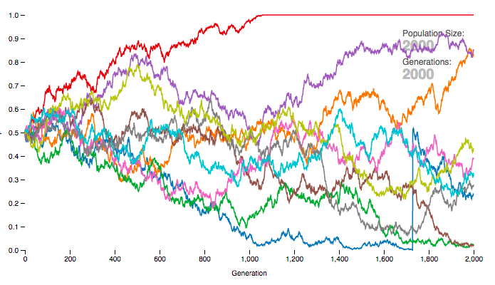

N = 200 and Generations = 2000

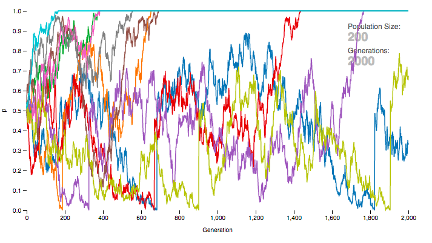

This example is implemented with **D3** line chart visualization in `/examples/genetic-drift`

Depens of the simulation the allele 1 (A1) 
is lost (0.0 probability) or allele 2 (A2) is lost (1.0 probability).
 
The key outcome of genetic drift is that
we lose genetic variation
and we observed that this process seems to happen at a speed
that is somehow proportional to the population size.

It seems to happen very **quickly in a small population**
and it seems to be **slower in large populations**. But why? 

We have 2N alleles, but in the moment before reproduction
 if we remember we have a gametes pool with a many many
  gametes inside. 

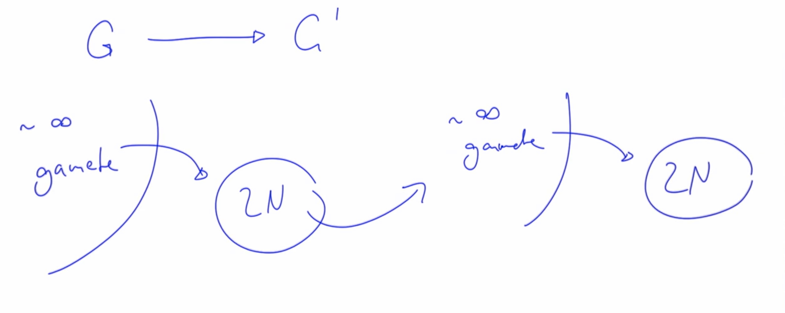

In every reproduction there are two possibilities:

1.  **G**: Pick the exact same allele again and you make a copy. The probability that this happen is **1 in 2N**.
  ```
  G = 1/2N 
  G' = 1/2N + ( 1 - 1/2N ) · G  
  ```
2.  **H**: Pick two different alleles. Each probability is:
  ```
  H = 1 - G
  H' = 1 - G'

  Remember:
  G' = 1/2N + ( 1 - 1/2N ) · G

  And replace G:
  H' = 1 - 1/2N + ( 1 - 1/2N ) · G 

  That is reduced to:
  H' = ( 1 - 1/2N ) · H
  ```

This is the factor why is proportional to the population size (**N**).


```
Ht = (1 - 1/2N)^t · H0
````

t is the number of generations. If t = infinite , Ht -> 0

```
2N · ln(2) ≈ t
```
If **N = 100** -> **t ≈ 140**

## Effective Population Size

Size of an ideal population that shows the same decay of genetic variaton
 as the actual population of interest.

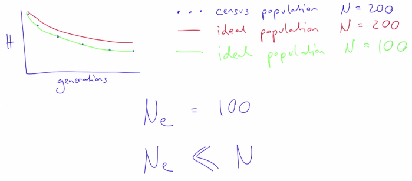

Individuals from a large population may split off and migrate away
to another location and build a new population there
from a few initial individuals.
This is something that's happened time and time again.
For example, when human started colonizing the planet.

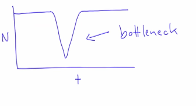

harmonic mean:  

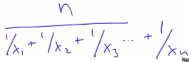

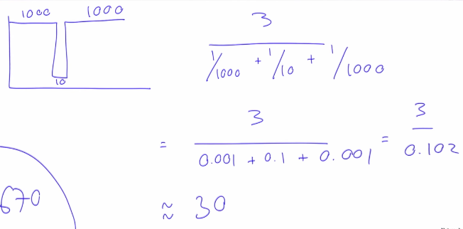

If the number of individus are bigger (p.e: 10.000) and the bottleneck are the same,
 the harmominc mean is the same, 30. And the average will be bigger, 6700.

 Now we simulate 10 simulations of 1000 individuals in 100 generations: 

 ```javascript 
import { drawLineChart } from './lib/visualize.js';

const N = 1000;
const generations = 100;
const simulations = 10;
const populationSizes = [];
const p = 0.5;

const nextGeneration = n => p => Array(n * 2).fill(1)
  .map(() => Math.random() < p)
  .filter(a1 => a1).length / (n * 2);

const getSimulation = () => {
  const nextGenerationKIndividuals = nextGeneration(N);
  const simulation = Array(generations).fill(1);

  simulation.forEach((x, i, a) => a[i] = nextGenerationKIndividuals(a[i-1] || p));
  return simulation;
};

// Harmonic mean
const harmonicMean = array => Math.round(array.length / array.map(num => 1/num).reduce((a, b) => a+b));

// Ne, Effective population size 
const Ne = harmonicMean(Array(N*2).fill(N));

drawLineChart(Array(simulations).fill(1).map(getSimulation),'Generation','p',['Eff. Population Size:',Ne,'Generations:',generations]);

 ```

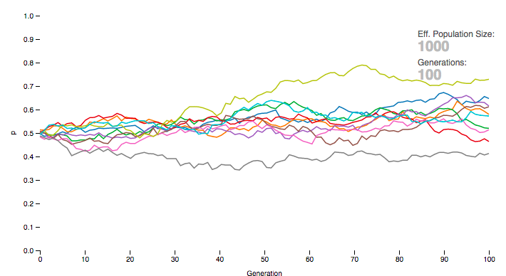

We have **Ne = 1000** (**Eff. Population size**) and is correct because we have the same N all the time (without bottlenecks).
 
Now we apply **bottlenecks**:

```javascript
import { drawLineChart } from './lib/visualize.js';

const N = 1000;
const NBottleneck = 10;
const generations = 100;
const simulations = 10;
const p = 0.5;

// Every 10 generations 
const isBottleNeckGeneration = i => i % 10 === 9;

const nextGeneration = n => p => Array(n * 2).fill(1)
  .map(() => Math.random() < p)
  .filter(a1 => a1).length / (n * 2);

const getSimulation = () => {
  const nextGenerationKIndividuals = nextGeneration(N);
  const nextGenerationBottleneck = nextGeneration(NBottleneck);
  const simulation = Array(generations).fill(1);

  simulation.forEach((x, i, a) =>  a[i] = isBottleNeckGeneration(i) ? nextGenerationBottleneck(a[i-1] || p) : nextGenerationKIndividuals(a[i-1] || p));
  return simulation;
};

// Harmonic mean
const harmonicMean = array => Math.round(array.length / array.map(num => 1/num).reduce((a, b) => a+b));

// Ne, Effective population size 
const Ne = harmonicMean(Array(N*2).fill(N).map((x,i) => isBottleNeckGeneration(i)? NBottleneck: N));

drawLineChart(Array(simulations).fill(1).map(getSimulation),'Generation','p',['Eff. Population Size:',Ne,'Generations:',generations]);
```

```
Note: 

i%10 === 9 is every 10 generations.
```

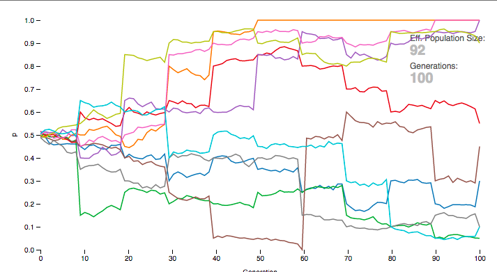

**92** is the **Effective population size**. If now we increase N from 1000 to 10000, the **Ne** change a litle bit from 92 to 99.

## Conclusion

* Finite population size introduces randomness into evolutionary dynamics (genetic drift)
* Genetic drift acts to reduce genetic variation.
* The effect of drift is proportional to the population size: the smaller the population, the larger the effect of drift.
* Unless other forces counter it, genetic drift will reduce all genetic variation in every population.
* Drift is a slow process - it takes about 1.4N generations to reduce the genetic variation of a population by half.
* The effective population size is a key concept - it is the size of an ideal (Wright-Fisher) population that shows the same decay of genetic variation as the actual population of interest.
* The effective population size is often smaller than the actual population size, due to various reasons such as population size bottlenecks, or unequal sex ratios.
* We’ve also covered some key programming concepts such as arrays and conditional flows.
