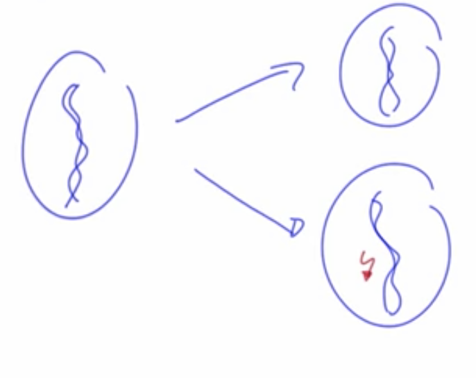

# Mutation: The Power of Mistakes

## DNA and Mutation

The DNA have 4 bases:

```
A = Adenine
G = Guanine
C = Cytosine
T = Thymine
```

Is possible that doing the step to copy the DNA into a new cell we have some **mutation**.



Image we have this **DNA sequence** in an array (in really the sequences are **MUCH BIGGER**):

```
['A', 'T', 'C', 'C', 'T', 'G']
```

To represent the mutation we are going to put the DNA sequences in a **3D array**:


```javascript
const properties = {
  sequenceLength: 20,
  numSequences: 100,
  numGenerations: 100,
  mutationRate: 0.001
};
  
const runGenerations = ({ sequenceLength, numSequences, numGenerations,  mutationRate }) => {
  const randomBase = (prev) => {
    const base = ['A','G','C','T'][Math.floor(Math.random() * 4)];
    return base === prev ? randomBase(prev) : base;
  };
  
  const someMutation = s => s.map(b => Math.random() < mutationRate ? randomBase(b): b); 
  
  const firstSequence = Array(sequenceLength).fill(1).map(randomBase);
  const firstGeneration = Array(numSequences).fill(firstSequence);
  const nextGenerations = Array(numGenerations).fill(0);
  nextGenerations.forEach((x, i, a) => a[i] = someMutation(a[i-1] || firstSequence));
 
  // Print results
  const printArray = a => console.log(a.toString().replace(/,/g, ''));
  console.log('Generation 0:')
  firstGeneration.forEach(printArray);
  console.log(`After ${numGenerations} generations:`);
  nextGenerations.forEach(printArray);
};

```

```
Result:

Generation 0:
(100) GTGAGCAGAAGTCTTGGTCG
After 100 generations:
(10) GTGAGCAGAAGTCTTGGTCG
(37) GTGAGCAGAAGTCTTGGACG
(19) GTGAGCAGAAGTCCTGGACG
(7)  GTGAGCAGAAGTCCTGGTCG
(27) GTGAGCAGAAGTCCGGGTCG
```

## Difference Mutation vs Genetic drift

* **Genetic drift** -> Decrease genetic variation
* **Mutation** -> Increase genetic variation

### Old formula *(Only with Genetic drift)*:
```
  G' = 1/2N + (1-1/2N) · G
```

### New formula *(Genetic drift + Mutation)*:
```
  G' = (1 - M)^2 · (1/2N + (1-1/2N) · G)
```

We add the possiblity to **mutate**. This equation simplicated is:

* **G**: Probability to pick the exact same allele again and you make a copy:
  ```
    G' = 1/2N + (1-1/2N) · G - 2·M·G
  ```
* **H**: Probability to pick two different alleles:
  ```
    H' = (1 - 1/2N)·H + 2·M(1 - H)
  ```

## Fixation Probability

Fixation is when one allele is in all the population because don't mutate.

### Probability of fixation = frequencie (p)

```
p = 1/2N
```

Example of **fixation probability** in JavaScript:

// TODO: Refactor

```javascript
const N = 100;
let p = 0.5;
const simulations = 10000;
let fixationsOfMutant = 0;
let totalGenerations = 0;

const nextGeneration = () => {
  const draws = 2 * N;
  let a1 = 0;
  let a2 = 0;

  for (let i = 0; i < draws; i += 1) {
    if(Math.random() <= p) {
      a1++;
    } else {
      a2++;
    }
  }
  p = a1 / draws;
};

const runUntilFixation = () => {
  p = 1 / (2 * N);
  let generations = 0;
  do {
    nextGeneration();
    generations++;
  } while (p > 0 && p < 1);
  if (p === 1) {
    fixationsOfMutant++;
    totalGenerations += generations;
  }
};

for (let i = 0; i < simulations; i += 1) {
  runUntilFixation();
}

console.log(fixationsOfMutant/simulations);
console.log(totalGenerations/fixationsOfMutant);

```