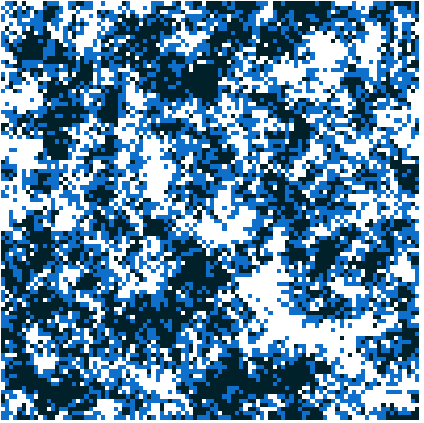

# Migration

Species normally pair with their **neighbors** *(except humans that we can travel with plane...)*.

*Example:*


If every cell of the square is an individual, we say that the distance is 1 equivalent to the probability of mating. 

## Inbreeding

Inbreeding is the **production of offspring** from the mating or breeding of individuals
 or organisms that are closely related genetically.
  By analogy, the term is used in human reproduction, but more commonly 
  refers to the genetic disorders and other consequences that may arise 
  from incestuous sexual relationships and consanguinity.

Inbreeding results in homozygosity, which can increase the chances of offspring 
being affected by recessive or deleterious traits. This generally leads to a 
decreased biological fitness of a population (called inbreeding depression), 
which is its ability to survive and reproduce. An individual who inherits such
 deleterious traits is referred to as inbred. The avoidance of expression of 
 such deleterious recessive alleles caused by inbreeding, via inbreeding avoidance
  mechanisms, is the main selective reason for outcrossing. Crossbreeding 
  between populations also often has positive effects on fitness-related traits.

Inbreeding is a technique used in selective breeding. In livestock breeding, breeders may use inbreeding when, for example, trying to establish a new and desirable trait in the stock, but will need to watch for undesirable characteristics in offspring, which can then be eliminated through further selective breeding or culling. Inbreeding is used to reveal deleterious recessive alleles, which can then be eliminated through assortative breeding or through culling. In plant breeding, inbred lines are used as stocks for the creation of hybrid lines to make use of the effects of heterosis. Inbreeding in plants also occurs naturally in the form of self-pollination.
## Example

Source in `./examples/migration/index.js`

1. Commands:
```
cd ./examples/migration/
npm start
```

2. Open index.html with the browser.

Result with **distance = 1** and **100x100 grid**:



White and black clusters are A1A1 and A2A2 homozygotes.
Blue is heterozygotes (A1A2)... 
And the number of heterozygotes individus go down in the time.

We basically observed that because we have a limited mating
distance here, individuals are much more likely to mate with the
same genotype.

The losing heterozygosity is measureble with the called **F statistics**.


* **e** = expected value
* **o** = observed value
* **

Statistic

```
F = (He - Ho) / He
```

Example we expected 100€ but we get 80€

e-o = 20€

In expectetion of 100.000.000€ observed is 99.999.980€
 (also missing 20€)

 ```javascript
const N = a1a1 + a1a2 + a2a2;
const Ho = a1a2 / N;
const p = ((2 * a1a1) + a1a2) / (2 * N);
const He = 2 * p * (1 - p);
const F = (He - Ho) / He;
 ```

 If F = 0 means that the expected is the same that the output.