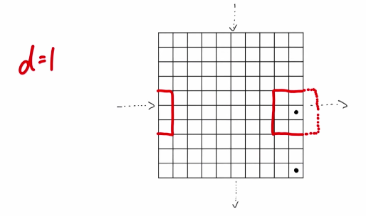

# Migration

Species normally pair with their **neighbors** *(except humans that we can travel with plane...)*.

*Example:*



If every cell of the square is an individual, we say that the distance is 1 equivalent to the probability of mating. 

```javascript
const gridLength = 100;
let grid;
let p = 0.5;
const maxMatingDistance = 1;
let generator_counter = 0;

const initGrid = () => {
    grid = Array(gridLength)
    .fill(1)
    .map(x => Array(gridLength).fill(1)
                .map(() => {
                    const x = Math.random();
                    if(x < p * p) return 'A1A1';
                    if(x < 1 - (1-p) * (1-p)) return 'A2A2';
                    else return 'A1A2';
                }));
};


initGrid();

const pickMatingPartner = (i, ii) => {
    const getBoundedIndex = i => {
        if(i < 0) return i + gridLength;
        else if(i >= gridLength) return i - gridLength;
        else return i;
    };
    const getRandomIndex = (min, max) =>  getBoundedIndex(Math.floor(Math.random() * (max - min + 1)) + min);

    const j = getRandomIndex(i - maxMatingDistance, i + maxMatingDistance);
    const jj = getRandomIndex(ii - maxMatingDistance, ii + maxMatingDistance);
    
    return grid[j][jj]; 
};

const getOffstring = () => {

};

const runGeneration = ()=> {
    let tempGrid = Array(gridLength).fill(1);

    tempGrid
    .map((x, i) => tempGrid.map((xx, ii) => getOffstring(grid[i][ii], pickMatingParner(i, ii)))
    .forEach((x, i) => tempGrid.forEach((xx, ii) => grid[i][ii] = xx));
};

for(let i =  0; i < 100; i++) {
    runGeneration();
}
```