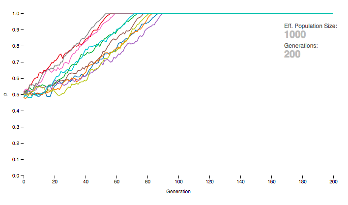
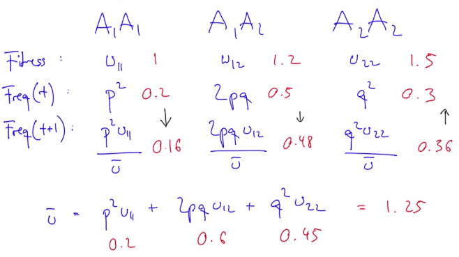
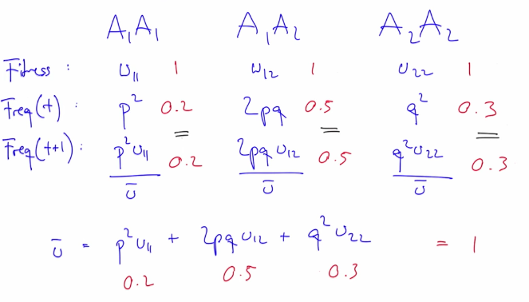
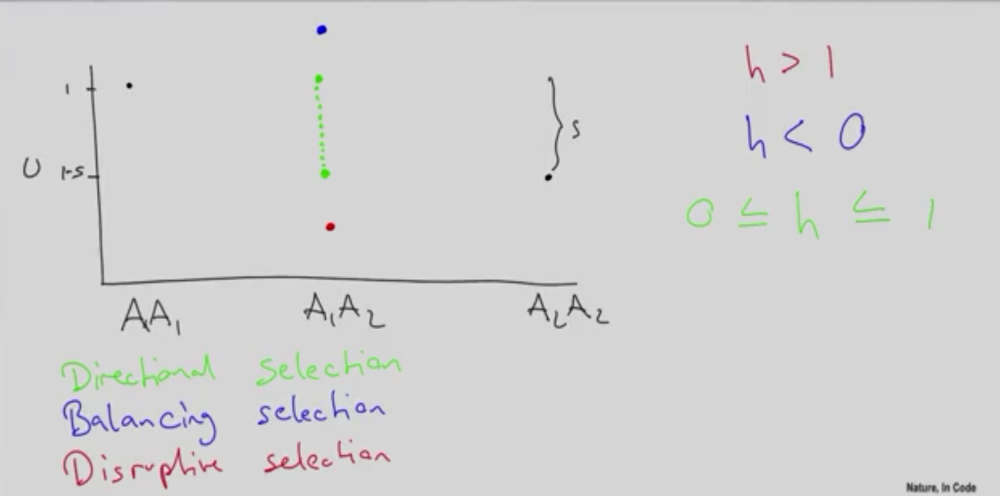
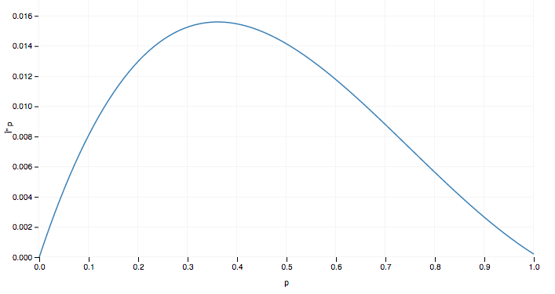
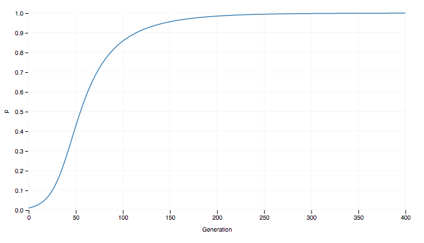
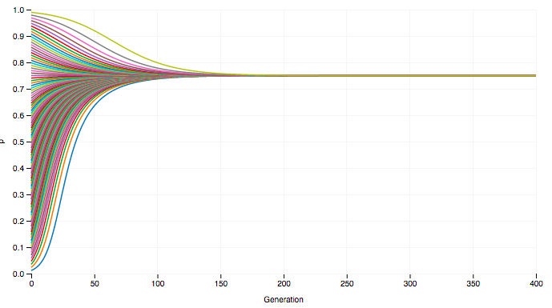
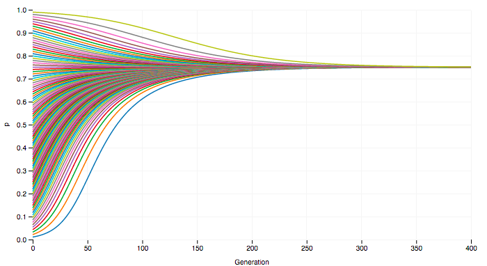
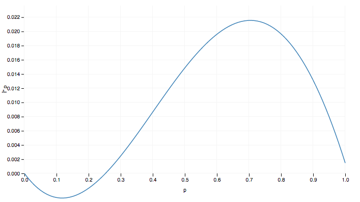
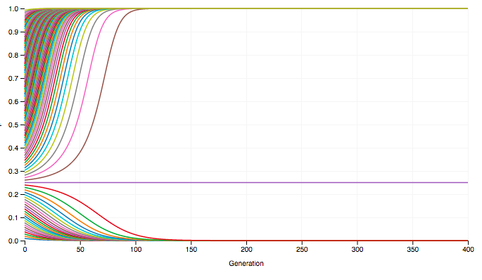

# Natural section

## Intro

**Natural selection** is often equated with evolution. But as you now know, evolution is simply the change in allele frequencies. Natural selection is just one of the forces affecting these allele frequencies. Thus, natural selection is not evolution - rather, natural selection is a cause of evolution.

What sets natural selection apart from the other forces that shape evolution (drift, mutation, and migration) is that it is the only force capable of producing adaptive traits. An adaptive trait is a trait of an individual - such as the color of a flower, the shape of a hand, the efficiency of a lung - that makes the individual well adapted to the environment it lives in. But what does “well adapted“ mean? It simply means that all else being equal, the individual is more likely to survive and produce offspring than it would without that specific trait.

Darwin’s insight was the following. In a world where natural resources are limited, there will be a struggle for survival and reproduction. Those individuals who are better adapted to survive, and to produce many offspring individuals, will contribute more offspring individuals to the next generation than those who are less well adapted. Because the offspring individuals inherit the traits that made their parents better adapted, those traits will increase in frequency over the generations.

We have so far in this course avoided the issue of the struggle for survival and reproduction. In all of our models so far, we have assumed that in terms of the probabilities of making it to the next generation, all alleles, and all genotypes, are equal. Natural selection occurs when that assumption is not true anymore. In this chapter, we'll take a close look at this major force in nature.

------------------

**Natural selection**: Only force capable of producing adaptive traits.

**Adaptative trait**: Makes the individual well adapted to the environment it lives in.

All else being equal, an individual with the trait is more likely to survive and produce offspring than individuals without the trait.

*Ex:*

***Yellow** insects. Are easy to birds to localize. Someone one of them mutate to **green** and the birds can't see it. A long of time, the greens survives and this is the natural selection.*

## Example in code 

We take the same example that genetic drif and modify to natural selection:

```javascript
import { drawLineChart } from './lib/visualize.js';

const N = 1000;
const generations = 200;
const simulations = 10;
const p = 0.5;

// 1. We remove bottlenecks
const nextGeneration = n => p => Array(n * 2).fill(1)
  // 2. We change a little bit (p * 1.01)
  .map(() => Math.random() < p * 1.01)
  .filter(a1 => a1).length / (n * 2);

const getSimulation = () => {
  const nextGenerationKIndividuals = nextGeneration(N);
  const simulation = Array(generations).fill(1);

  simulation.forEach((x, i, a) =>  a[i] = nextGenerationKIndividuals(a[i-1] || p));
  return simulation;
};

const harmonicMean = array => Math.round(array.length / array.map(num => 1/num).reduce((a, b) => a+b));
const Ne = harmonicMean(Array(N*2).fill(N));

drawLineChart(Array(simulations).fill(1).map(getSimulation),'Generation','p',['Eff. Population Size:',Ne,'Generations:',generations]);
```

Result:



## Fitness

**Fitness**: Capability to A1 = A2. (We assue A1 != A2 in all moment in this course)

We anotate:

* Fitness of A1A1: `w11`
* Fitness of A1A2: `w12`
* Fitness of A2A2: `w22`

Frequencies of genotypes:

* Freq(t) A1A1: `p^2`
* Freq(t) A1A2: `2pq`
* Freq(t) A2A2: `q^2`

Frequence of genotypes in the next generation:

* Freq(t + 1) A1A1: `((p^2)·w11) / ◡`
* Freq(t + 1) A1A2: `2pq·w12 / ◡`
* Freq(t + 1) A2A2: `(q^2) · w22 / ◡`

`◡ = (p^2)·w11 + 2pq·w12 + (q^2) · w22`

*Examples:*




More formulas:

`p' = ((p^2)·w11 + p·q·w12) / ◡`

**Sumatory of p** = p' - p, is equal to:

`delta p = p' - p = (pq(p(w11-w12)+q(w11-w22))) / p^2·w11 + 2pq·w12 + q^2 · w22`

* S = Selection coeffient
* h = Heterozygous effects

We can simplify the equation with:

`delta p = p' - p = (pqs(ph+q(1-h))) / (1 - 2pqhs - 2qs)`



## Directional Selection (0 <= h <= 1)

```javascript
import { drawLineChart } from './lib/visualize.js';

const calculateDeltaP = (s, h, p, q) => 
  (p * q * s * (p * h + q * (1 - h))) / (1 - 2* p * q * h * s - 2 * q * s);
  
const data = Array(100).fill(1)
  .map((x, i) => ({ p: i/100, q: 1 - i/100}))
  .map(x => calculateDeltaP(0.1, 0.2, x.p, x.q));

drawLineChart(data, 'p', '\u0394 p', [], 1, true);
```

Result:



Another simulation:

```javascript
import { drawLineChart } from './lib/visualize.js';

const s = 0.1;
const h = 0.2;
let p = 0.01;
const generations = 400;

const calculateDeltaP = (s, h, p, q) => 
  (p * q * s * (p * h + q * (1 - h))) / (1 - 2* p * q * h * s - 2 * q * s);
  
const data = Array(400).fill(1)
  .map(x => {
    const deltaP = calculateDeltaP(s, h, p, 1 - p);
    p += deltaP;
    return p;
  });

drawLineChart(data, 'Generation', 'p', []);
```

Result:



Delta p is always possitive. And p go to fixation.

## Balancing Selection (h < 0)

Now if we modify a little bit the code and add more simulations:

```javascript
import { drawLineChart } from './lib/visualize.js';

const s = 0.1;
const h = -0.5; // Change 0.2 to -0.5
const generations = 400;
const data = [];

const calculateDeltaP = (s, h, p, q) => 
  (p * q * s * (p * h + q * (1 - h))) / (1 - 2* p * q * h * s - 2 * q * s);
  
// Add pValues an array of 99 0.01 to 1 (1 not included)  
const pValues = Array(99).fill(1);

// Modify p values vs time
pValues.forEach((x, i, a) => (a[i] = (a[i-1] || 0) + 0.01));

const runSimulation = p => {
  const results = Array(400).fill(1)
    .map(x => {
      const deltaP = calculateDeltaP(s, h, p, 1 - p);
      p += deltaP;
      return p;
    });
    data.push(results);
};

// Run simulations with p as a parameter
pValues.forEach(runSimulation);

drawLineChart(data, 'Generation', 'p', []);

```

Result:



When hetero zygotes mate under Mendelian inheritance
you get half hetero zygotes
but you also always get the homo zygotes, and so
as a consequence this will not go up to 1 because the hetero zygote
which is always both alleles is the fittest
and that's why you have this equilibrium.

```
P* = h - 1 / 2h - 1 =
= -1.5 / -2 = [0.75]  
(Just the point to fixation)
```

If we change in the code **s** from 0.1 to **0.05** we can see that only effect on the time but not on the effect of fixation.



## Discruptive selection (h > 1)

We change: 

```javascript
const h = 1.5; // Change value to > 1
```

And now:

Delta p vs p:



p vs time:



At point 0, 0.25 and 1 tend to fixation. 

The point 0.25 is calculated in the same way:

```
P* = h - 1 / 2h -1 = 0.5/2 = 0.25
```
