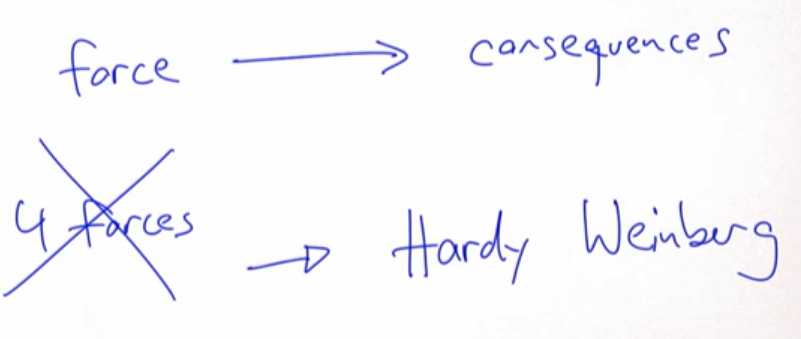

# Hardy-weinberg model

## Null model

Null model is a very important idea in all of science.
Imagine you have some kind of system
and now you're applying some force to the system,
and then later you may observe that the system changes,
so there is some consequences possibly of you applying this force.

But how do you in fact know that the system changed
*because* you applied this force?

Is it possible that the system would have changed,
or now behaves in a way that it would have anyway,
without you applying this force?

And so, what you need to do in order to understand this,
is you need to remove this force,
need to remove all forces of interest
to get to a **null model** that describes the system, how it would work
without any of the forces that you're interested in.

We have **four forces**,
that we now understand, are major forces to affect evolution
and to affect the composition and the allele frequencies in populations.

And so what we need to do is we need to ensure
that **none of those four forces is acting**,
in order to get to our **null model**.

## Hardy-weinberg model

Is a very simplified model of the world,
but it helps us understand what would happen.

What does the world look like from a population genetic perspective
if none of those four forces is acting?

Hardy-Weinberg is right there at the beginning
because we need to understand what happens without any of those four forces,
and then we can later slowly add the forces one by one,
either in combination or as single forces,
and then we can understand much better what happens *because* of those forces.

So we'll implement this very shortly in **JavaScript**.

