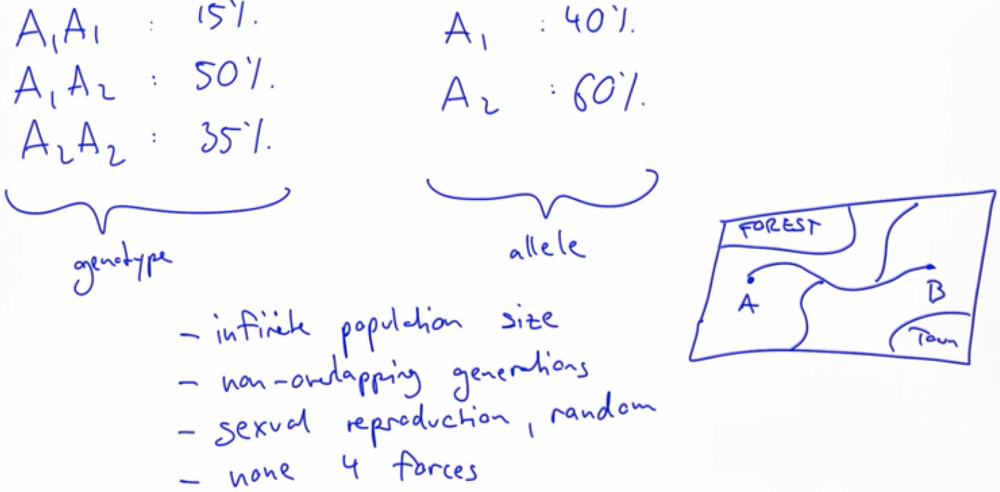
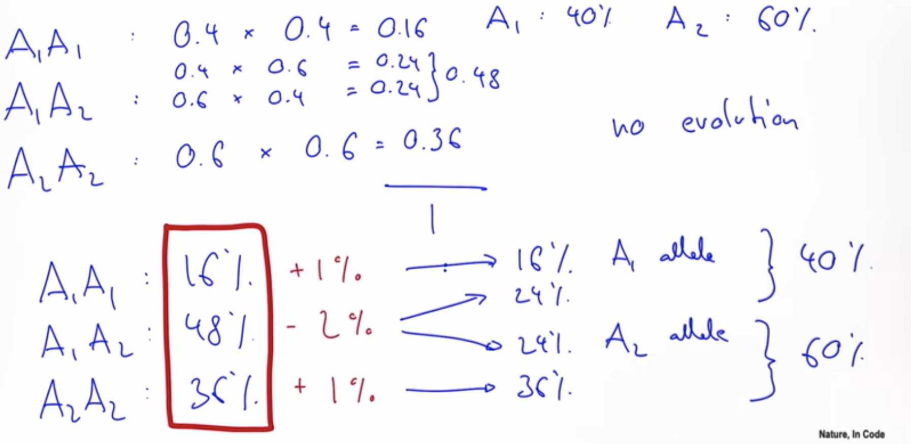
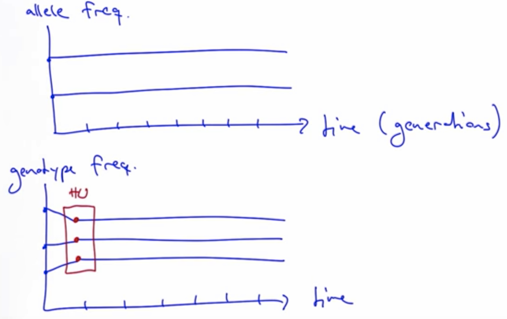

# Hardy-Weinberg Frequencies

We started with this population of three different genotypes,
A1A1, A1A2, and A2A2, and we observed those
at 15% frequency, 50% frequency, and 35% frequency,
and from that we deduced the A1 and A2 allele frequency
is at 40% and at 60%. So these are the **genotype frequencies** and **alleles frequencies**.

If we were to make an assumption of a finite population size
and potentially, in fact, a small population size,
then we would get effects of random chance
and this would be genetic drift.

But remember, we want to develop a null model
that doesn't have any of the four forces (Hardy-Weinberg). So, we were to make an assumption of a **infinite population size**.

* **Infinite population size**
* **Non-overlapping generations**: So, when a new generation is born,
the old generation dies immediately.
* **Sexual reproduction, random**
* **None 4 forces**

Very simplified representation of the real world. Like a simple map that only have a few key components.

Imagine that we have an infinitely-sized gamete pool,
and in this gamete pool we have two types of alleles; 40% is of type A1 allele, 60% is of A2.

* **A1**: that happens with a probability of 0.4
* **A2**: that happens with a probability of 0.6

So:

* **A1A1**: that happens with a probability of 0.4 * 0.4 = 0.16 => 16%, increase of 1%
* **A1A2 or A2A1**: that happens with a probability of (0.4 * 0.6) * 2 = 0.48 => 48%, deacrease of 2%
* **A2A2**: that happens with a probability of 0.6 * 0.6 = 0.36 => 36%, increase of 1%

If we count, we have 40% A1, 60% A2 again. Remember in this model,
we got rid of all the forces that are known to affect the A1 and A2,
or just any type of allele frequency,
so it's completely in line with our model
that the allele frequencies do in fact not change,
they remain constant, or in other words,
we have **no evolution** as we defined it.

For evolution, we need a change in these numbers over time,
but this doesn't happen-- it stayed constant, 40% and 60%.

We would have **constant values** here over time,
so two straight lines.

The genotype frequencies, the three values, in our current model
one of them goes down, and the other two go slightly up. So they change within one generation, but then from there,
they will in fact remain constant.

And these values here now,
these are the **Hardy Weinberg genotype frequencies**.

And this sums up the **Hardy Weinberg model**.
