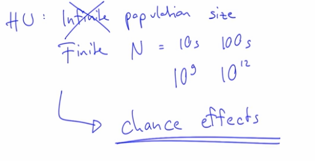

# Genetic drift: Intro

Now we are changing the rules of the previus Chapter. 
Now we are working with **Finite population size**.



Population size is typically denoted
with this capital "**N**" letter.

Now a finite population size can mean many things.
We can talk about only tens of individuals,
or perhaps hundreds of individuals,
but we can also talk about a very, very large population size,
even billions of individuals,
or sometimes even trillions of individuals.

If you think about, for example, single-celled organisms,
bacteria, for example,
these can often be--
the population sizes of these species can often be very, very large.

With finite population sizes,
there are **chance effects**,
and this is the key effect of this chapter
and the principal cause of **genetic drift**.

**Chance effects** will be stronger in smaller populations.

## *Example:*

50% means that if you flip 10 times a coin 5 times was head and 5 times was tail? 
No... Maybe is 4:6, 3:7, 6:4... etc **It's not always the same result**!
It's random! 0:10 and 10:0 are also possible...


We can calculate how often are each of these scenarios with 
the **binomial distribution**.

Imagine that we have 10 slots, each of these slots can have one of two outcomes:
namely heads (H) or tails (T).
 
### **What is the probability that we get exactly two tails?**

1. Know
how many possible outcomes are there in the first place: **2 outcomes**.
2. Know how many times/slots are you flipping the coin: **10 times/slots**.
3. Know how many possible outcomes we have? **2^10 = 1024**.
4. Know how many possible ways to put two *Tails* into the ten slots?
    * Put one Tail: **10 possible slots**
    * Put the second Tail: **9 possible slots**
    * Number of ways to put those: **2**
    * Possible outcomes: (10 x 9) / 2 = **45**
5. Know the probability
that we get exactly two tails when we flip a fair coin ten times: 45/1024 = 0.0439 => **4,39 %**

**Another way to do it (via JavaScript):**

```javascript 
const tossCoins = () => {
  let heads = 0,
      tails = 0;

  for(let i = 0; i < 10; i += 1) {
      Math.random() < 0.5 ? heads += 1 : tails += 1;
  }
  
  return tails === 2;
}


const repeats = 10000000;
let counter = 0;

for(let i = 0; i < repeats; i += 1){
  if(tossCoins()) {
    counter += 1;
  }
}

console.log(`Getting 2 tail ${(counter/repeats)} % of the time`);
// => "Getting 2 tail  0.0439117 % of the time"
```

----------------
**Another exemple in JavaScript**

Write a function **children_in_family** that returns a number between 0 and 6 with the following probabilities:

* 0: 10%
* 1: 26%
* 2: 33%
* 3: 18%
* 4: 9%
* 5: 3%
* 6: 1%

Example: If we call the function **children_in_family** 1000 times, we should get the number 0 100 times, the number 1 260 times, the number 3 330 times, and so on.

```javascript
function children_in_family() {
    var value = Math.random();
    if (value < 0.1 ) return 0; // 10% =       10% ;-)
    if (value < 0.36) return 1; // 36% = 10% + 26%
    if (value < 0.69) return 2; // 69% = 36% + 33%
    if (value < 0.87) return 3; // 87% = 69% + 18%
    if (value < 0.96) return 4; // 96% = 87% +  9%
    if (value < 0.99) return 5; // 99% = 96% +  3%
    return 6;
}
```

